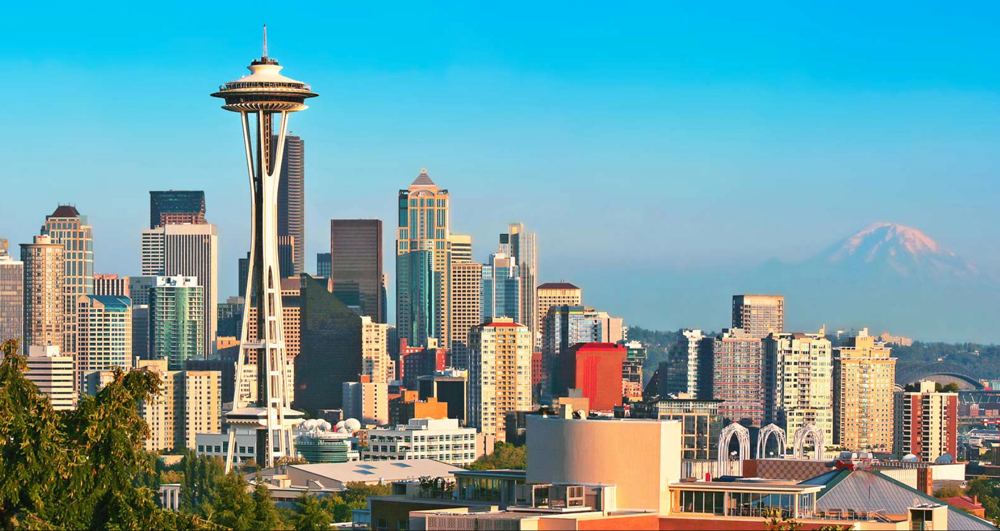

Because of my background, language skills and technical skills, I have the choice of living in a lot of different places. 
Two places stand out: South Florida and the Seattle area. Choosing between them has been a struggle for as long as I can remember
and I have moved back and forth more times that it's reasonable, and traveled back and forth more than most people could
imagine.

It is still a struggle for my family at this point.

## Florida

	

Although there are several disadvantages, you should try living in Florida at some point in your life to see if it is for you. 

### Advantages

* The weather is nice for most of the year (but it really sucks for 4-5 months)
* There's a lot to see: Orlando parks, Florida keys, Miami, Clearwater, Everglades...
* Lots of restaurants that you don't see in other places: Cuban, Lebanese
* Brazilian supermarket, [Lebanese supermarket](https://coralspringstalk.com/eat-like-a-sheikh-at-sahara-mediterranean-market-in-coral-springs-19713)
* One quick hop from Fort Lauderdale or Miami to Brazil, and mostly to anywhere
* People-intensive services (gardening, baby-sitting) are relatively cheap

### Disadvantages

* Car insurance, hurricane insurance, flood insurance and property tax are atrocious
* Politicians [are](https://www.miamiherald.com/news/local/community/broward/article224080655.html) [worse](https://www.sun-sentinel.com/opinion/editorials/fl-op-edit-broward-superintendent-robert-runcie-20181229-story.html) 
  than other places, and that's saying [something](https://nypost.com/2019/02/11/northam-i-overreacted-in-initial-apology-for-racist-photos/)
* The Parkland shooting resulted in a lot of bad changes in the school district:
  - Can't have lunch with kids anymore
  - Lots of police at school, so there's more people to [do nothing and retire with a pension](https://www.sun-sentinel.com/local/broward/parkland/florida-school-shooting/fl-ne-peterson-pollack-civil-hearing-20181211-story.html) in case of trouble
* Job market sucks: almost all of my colleagues that were [laid off](https://www.seattletimes.com/business/microsoft/microsoft-starts-layoffs-with-reportedly-thousands-of-job-cuts/) in Florida had to move to other states
* Not many high-ranked public universities, not a lot of jobs after graduation
* Hurricanes

## Seattle

### Advantages

* If you work in tech, there are a lot of jobs
* The headquarters for the company I wortk for is there
* The University of Washington is a powerhouse, and there are plenty of jobs after graduating

### Disadvantages

* Did you see the [house prices](https://wolfstreet.com/2019/01/08/housing-bubble-trouble-in-the-seattle-bellevue-metro/) lately?
* The weather sucks for most of the year
* Kinda far away from everywhere

## So what are we going to do?

We're still thinking very hard about it, and we don't know. We are also considering Boston (good jobs, sucky winter), and maybe something more
adventurous like going to Europe or Asia for a short period.